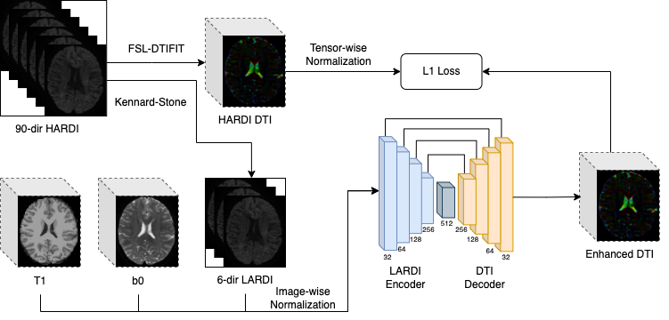

# HADTI-Net

Official PyTorch implementation of HADTI-Net: High Angular Diffusion Tensor Imaging Estimation from Minimal Evenly Distributed Diffusion Gradient Directions




## Dependencies

* Python >= 3.6

*Pytorch version*
* torch >= 1.5.0
* torchvision >= 0.6.0

## Data

**Please refer to the official website (or project repo) for license and terms of usage.**
**Some preprocessing have been applied to the original data before feeding into our data loader. Please find the details in our paper.**

**HPC**

- Official Website: https://www.humanconnectome.org/


**Train**
Please refer to the training script in the scripts folder
```

python3 ./train_angular_sr.py \
--dataroot /home/sheng/Diffusion/data \
--name hadti_net \
--model hadti \
--net U3D \
--lr 0.0001 \
--input_nc 8  \
--output_nc 6  \
--dataset_mode angular_sr \
--data_norm z_scoreV2 \
--num_threads 2 \
--batch_size 1 \
--input_batch_sizes 8 \
--patch_shape 64 \
--patch_overlap 32 \
--bounding \
--n_epochs 5 \
--n_epochs_decay 0 \
--display_freq 10 \
--save_epoch_freq 5 \
--gpu_ids 1
```

**Test**
Please refer to the testing script in the scripts folder
```

python3 ./test_angular_sr.py \
--dataroot /home/sheng/Diffusion/data \
--name hadti_net \
--model hadti \
--epoch latest \
--net U3D \
--input_nc 8  \
--output_nc 6  \
--dataset_mode test \
--data_norm z_scoreV2 \
--serial_batches \
--batch_size 1 \
--bounding \
--patch_shape 64 \
--patch_overlap 32 \
--input_batch_sizes 8 \
--eval \
--num_threads 0 \
--num_test 20 \
--save_prediction 1 \
--gpu_ids 1
```

<!-- Our code framework heavily brought from [CycleGAN](https://github.com/junyanz/pytorch-CycleGAN-and-pix2pix). We appreciate the authors for their contributions on a great open-source framework of deep adversarial learning! -->